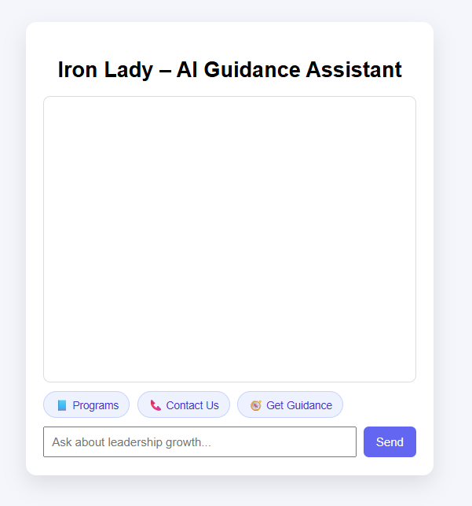
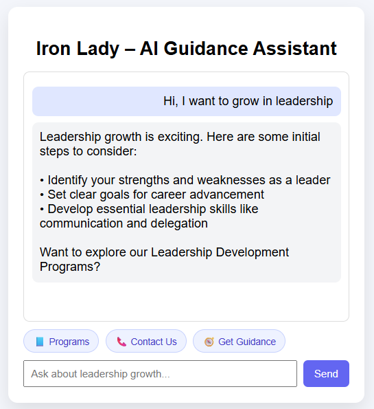
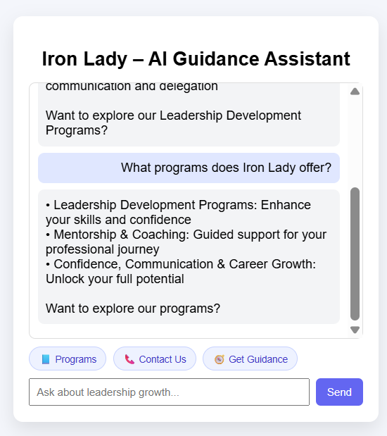
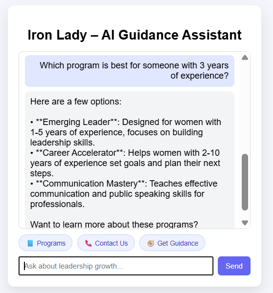
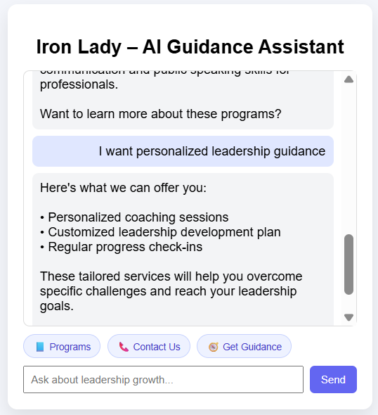

# Task 1 – AI-based Customer Interaction Assistant (Iron Lady)

## 🎯 Business Context
Iron Lady provides leadership, mentorship, and career growth programs for women professionals.

Prospective learners often need clarity about:
- Available programs
- Eligibility
- Outcomes
- Enrollment process

Manual handling of these queries limits scalability and delays engagement.

---

## ❓ Problem Statement
How can Iron Lady provide **instant, accurate, and personalized guidance** to learners while reducing manual support effort?

---

## 💡 Solution Overview
An **AI-powered conversational assistant** that:
- Explains Iron Lady’s programs clearly
- Guides users through the learner journey
- Answers questions in natural language
- Improves engagement and decision-making

This assistant acts as a **first-level AI support system**.

---

## 🤖 Use of AI
- Understands user intent through natural language
- Generates context-aware responses
- Suggests relevant Iron Lady programs
- Improves user experience through conversational flow

---

## 🛠 Tech Stack
- **Frontend:** React
- **Backend:** Spring Boot
- **AI Integration:** OpenAI / Groq API
- **Communication:** REST APIs

---

## 📸 Application Screenshots

### AI Guidance Assistant – User Flow

**1. Application Interface**

**2. User Greeting**

**3. Programs Explanation**

**4. AI Recommendation**

**5. Guidance & Next Steps**

